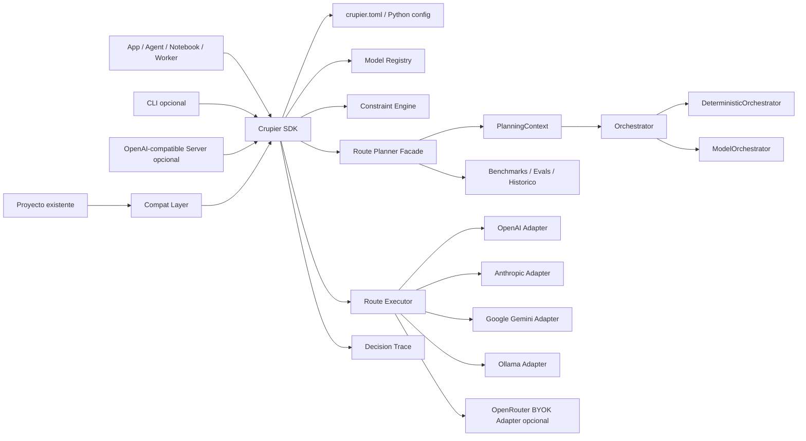
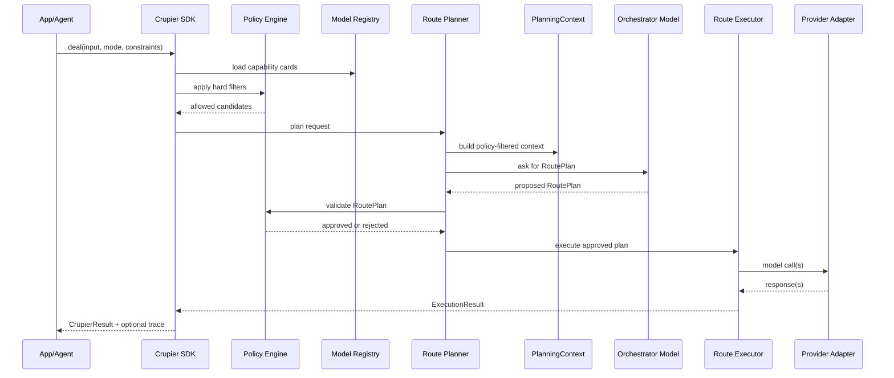

# Crupier: Arquitectura Conceptual

Fecha: 2026-06-18  
Estado: arquitectura de producto con implementacion inicial `0.1.0` en `src/crupier`, incluyendo adapters reales de texto para OpenAI, Anthropic Claude y Ollama Cloud.

## Objetivo

Crupier sera un SDK Python de orquestacion de modelos para agentes y aplicaciones de IA. Su trabajo es decidir que modelo, combinacion de modelos o estrategia de ejecucion conviene para una peticion concreta, usando constraints del proyecto, capacidades, benchmarks, historico, costes, latencia y preferencias de calidad.

La arquitectura debe permitir dos movimientos a la vez: integracion nativa para proyectos nuevos y adopcion drop-in para proyectos existentes. Un proyecto descargado de GitHub deberia poder beneficiarse de Crupier con cero cambios de codigo cuando sea posible, o con un cambio minimo cuando el stack lo requiera.

## Forma del Sistema



## Principios Arquitectonicos

1. El core vive en Python y no requiere servidor.
2. El server/gateway futuro es una envoltura del core, no otro producto.
3. Las decisiones deben ser explicables mediante `DecisionTrace`.
4. El orquestador decide solo entre candidatos ya permitidos por constraints duros.
5. Los modelos estables se prefieren para produccion; aliases `latest` son opt-in.
6. OpenRouter es adapter BYOK opcional, no proveedor por defecto de Crupier.
7. Prompts/respuestas solo se guardan si el proyecto lo activa.
8. Las fichas de modelos son versionadas y actualizables por proyecto.
9. Crupier no es un gateway de seguridad; su trabajo es routing, preparacion de input y optimizacion de calidad/coste/latencia.
10. La adopcion drop-in es una capa de compatibilidad sobre el mismo core, no un producto separado.

## Adopcion Drop-In

Crupier debe ofrecer varios caminos para proyectos existentes:

- Nivel 0: server OpenAI-compatible, cambiando `OPENAI_BASE_URL` cuando el proyecto lo permita.
- Nivel 1: autopatch/monkeypatch opt-in para SDKs Python conocidos.
- Nivel 2: clientes compatibles como `crupier.compat.openai.OpenAI`.
- Nivel 3: SDK nativo con `Crupier.from_project().deal(...)`.

La promesa no es magia absoluta. Si un proyecto usa APIs, objetos, streaming, tools o archivos de forma muy especifica, Crupier debe emular el contrato con fidelidad o hacer pass-through/fallar con error claro. El detalle vive en `docs/crupier-drop-in-adoption.md`.

## Flujo Principal



## API Mental

La API publica debe sentirse propia, pero familiar para quien viene de OpenAI-like SDKs.

```python
from crupier import Crupier

crupier = Crupier.from_project()

result = crupier.deal(
    task="Review this agent plan and produce a better model route",
    input=payload,
    mode="agentic",
)

print(result.output_text)
print(result.route.model_summary)
```

### Async

```python
result = await crupier.adeal(
    task="Extract structured fields from these documents",
    input=docs,
    mode="structured",
)
```

### Fusion Explicita

```python
result = crupier.deal(
    task="Compare these architecture options",
    input=context,
    mode="research",
    strategy="fusion",
)
```

### Compatibilidad OpenAI-like

La prioridad no es clonar OpenAI, pero si facilitar migracion:

```python
result = crupier.responses.create(
    input="Summarize this",
    mode="cheap",
)
```

## Archivo de Proyecto

Borrador de `crupier.toml`:

```toml
[project]
name = "my-agent-project"
default_profile = "agentic"

[logging]
mode = "metadata"
store_prompts = false
store_responses = false
redact_secrets = true

[providers.openai]
enabled = true
env_key = "OPENAI_API_KEY"

[providers.anthropic]
enabled = true
env_key = "ANTHROPIC_API_KEY"

[providers.google]
enabled = true
env_key = "GOOGLE_API_KEY"

[providers.ollama]
enabled = true
host = "https://ollama.com/api"
env_key = "OLLAMA_API_KEY"

[providers.openrouter]
enabled = false
env_key = "OPENROUTER_API_KEY"
mode = "byok"

[models]
allow = [
  "openai:gpt-5.5",
  "anthropic:claude-opus-4-8",
  "google:gemini-3.5-flash",
  "ollama:gpt-oss:120b"
]
deny = []

[routing]
default_strategy = "orchestrated"
allow_fusion = true
allow_parallel = true
allow_latest_aliases = false
max_cost_per_request_usd = 1.00
max_latency_ms = 30000

[orchestrator]
mode = "deterministic"
model = "openai:gpt-5.4-mini"
fallback_model = "google:gemini-3.5-flash"
fallback = "deterministic"
temperature = 0
require_validated_plan = true
max_repairs = 1
allow_prompt_summary_only = true

[profiles.agentic]
prefer = ["tool_use", "coding", "long_horizon", "reliability"]
strategy = "orchestrated"

[profiles.private]
prefer = ["local", "zdr", "no_prompt_logging"]
strategy = "local_first"

[profiles.research]
prefer = ["web", "citations", "consensus", "critique"]
strategy = "fusion"
```

## Comandos CLI Conceptuales

La CLI es capa auxiliar, no obligatoria.

```bash
crupier init
crupier update
crupier models list
crupier profiles list
crupier eval run
crupier trace inspect <trace-id>
```

### `crupier update`

Responsabilidades:

1. Leer `crupier.toml`.
2. Resolver proveedores y modelos permitidos.
3. Consultar APIs/fuentes disponibles de capacidades.
4. Detectar modelos deprecated, preview, latest o experimentales.
5. Actualizar `capability cards`.
6. Actualizar precios y limites conocidos.
7. Marcar incompatibilidades de parametros.
8. Opcionalmente correr evals locales.
9. Regenerar `route profiles`.
10. Emitir un informe de cambios.

## Objetos Centrales

### `ModelRef`

Identificador normalizado de modelo.

Campos conceptuales:

- `provider`: `openai`, `anthropic`, `google`, `ollama`, `openrouter`.
- `model`: ID real del proveedor.
- `alias`: opcional.
- `stability`: `stable`, `preview`, `latest`, `experimental`, `deprecated`.
- `source`: `native`, `openai_compatible`, `byok_gateway`.

Ejemplo:

```json
{
  "provider": "anthropic",
  "model": "claude-opus-4-8",
  "stability": "stable",
  "source": "native"
}
```

### `CapabilityCard`

Ficha local de capacidades por modelo/proveedor.

Campos conceptuales:

- `model_ref`
- `last_updated`
- `context_window`
- `max_output_tokens`
- `model_kind`
- `modalities_input`
- `modalities_output`
- `supports_embeddings`
- `embedding_dimensions`
- `embedding_input_modalities`
- `supports_tools`
- `supports_structured_output`
- `supports_streaming`
- `supports_web`
- `supports_file_input`
- `supports_code_execution`
- `pricing`
- `latency_profile`
- `data_retention`
- `zdr_eligible`
- `regions`
- `unsupported_params`
- `known_edge_cases`
- `benchmarks`
- `local_eval_scores`
- `capability_status`
- `probe_results`
- `deprecation`

`model_kind` separa modelos `chat` de modelos `embedding` para no intentar usar un modelo vectorial como chat ni pedir embeddings a un modelo conversacional. `supports_embeddings` solo debe considerarse seguro cuando la ficha viene de un modelo dedicado o de un probe real.

`capability_status` usa estados como `verified`, `inferred`, `unknown` y `failed`. `probe_results` guarda metadata de probes sin prompts ni respuestas crudas.

Probes actuales: `text_basic`, `json_instruction`, `max_output_param`, `structured_output`, `tool_call`, `streaming` y `embeddings`. `embeddings` no forma parte del set default de probes chat; readiness lo usa para modelos `model_kind="embedding"`.

Policy y selector usan esa evidencia. `verified` recibe mas peso que `inferred`; `failed` bloquea una capacidad requerida. Con `require_verified_capabilities`, tools, structured output, streaming, embeddings y multimodalidad solo pasan si la evidencia esta verificada.

### `PolicyProfile`

Restricciones duras y preferencias blandas.

Campos conceptuales:

- `allowed_providers`
- `denied_providers`
- `allowed_models`
- `denied_models`
- `max_cost_per_request`
- `max_latency_ms`
- `require_zdr`
- `allow_prompt_storage`
- `allow_response_storage`
- `allow_preview_models`
- `allow_latest_aliases`
- `allow_cross_region`
- `allowed_tools`
- `sensitive_data_level`

### `RequestEnvelope`

Entrada normalizada antes del routing.

Campos conceptuales:

- `task`
- `input`
- `messages`
- `files`
- `tools`
- `response_schema`
- `mode`
- `strategy`
- `constraints`
- `metadata`
- `tenant_id`
- `user_id_hash`

### `PlanningContext`

Entrada estructurada que recibe cualquier orquestador.

Campos implementados:

- `request`
- `candidates`
- `filters_applied`
- `deterministic_scores`
- `orchestrator_mode`
- `metadata`

El `RoutePlanner` publico construye este contexto y delega en un `Orchestrator`. La implementacion actual usa `DeterministicOrchestrator` por defecto y puede activar `ModelOrchestrator` con `[orchestrator].mode = "model"` o `"hybrid"` sin cambiar la API publica.

## Multimodalidad

Crupier trata imagenes, PDFs y otros archivos como inputs que deben convertirse en la representacion mas eficiente para la tarea. El objetivo no es inspeccionar contenido por seguridad; es decidir si conviene usar un modelo multimodal nativo, extraer texto/tablas, hacer OCR, resumir por chunks, o combinar varias rutas para lograr mejor calidad, menor coste y menor latencia.

### Modelo Conceptual

Un archivo se normaliza como un `FileAsset` conceptual:

- `kind`: `image`, `pdf`, `audio`, `video`, `spreadsheet`, `document`, `text`, `code`, etc.
- `mime_type`
- `size_bytes`
- `page_count` o `duration_seconds` cuando aplique
- `representation`: `native`, `extracted_text`, `ocr_text`, `table_rows`, `frames`, `transcript`, `chunks`
- `required_capabilities`: `vision_input`, `pdf_native_input`, `ocr`, `audio_input`, `video_input`, `file_input`, `large_context`, `table_extraction`

### Imagen

Para una imagen, el planner compara rutas:

- modelo vision nativo si `vision_input` esta verificado y la tarea requiere lectura visual;
- OCR/text extraction si la tarea es leer texto o factura simple;
- modelo barato para clasificacion simple;
- modelo de mayor calidad para analisis visual complejo.

### PDF

Un PDF se decide por coste y representacion:

- PDF textual: extraer texto y pasar chunks a modelos de texto;
- PDF escaneado: OCR o vision por pagina;
- PDF con tablas: extraer tablas antes de pedir JSON/schema;
- PDF largo: chunking, resumen jerarquico o modelo de contexto largo;
- PDF nativo: solo si el proveedor/modelo tiene `pdf_native_input` verificado y sale mejor en calidad/coste.

### Otros Archivos

- CSV/XLSX: parsear estructura antes de usar LLM.
- DOCX: extraer texto, tablas y comentarios.
- Audio: transcripcion primero salvo modelo audio nativo verificado.
- Video: muestreo de frames + transcripcion.
- Codigo: tratar como arbol de archivos/chunks, no como blob unico.

La policy no actua como scanner. Solo aplica constraints declarados por el proyecto: modelos permitidos, coste, latencia, modalidad, region/privacidad si el usuario lo configura, y capacidades verificadas.

### `RoutePlan`

Plan que el orquestador propone y el validador aprueba.

Campos conceptuales:

- `strategy`: `single`, `fallback`, `cascade`, `panel`, `fusion`, `critique_repair`, `local_first`.
- `steps`
- `estimated_cost`
- `estimated_latency`
- `reason`
- `policy_filters_applied`
- `risk_level`
- `requires_user_confirmation`

Ejemplo:

```json
{
  "strategy": "fusion",
  "risk_level": "high",
  "steps": [
    {
      "role": "panel",
      "models": [
        "openai:gpt-5.5",
        "anthropic:claude-opus-4-8",
        "google:gemini-3.5-flash"
      ],
      "timeout_ms": 30000
    },
    {
      "role": "judge",
      "model": "anthropic:claude-opus-4-8"
    },
    {
      "role": "final_writer",
      "model": "openai:gpt-5.5"
    }
  ],
  "reason": "High-risk architecture decision benefits from independent model perspectives and synthesis."
}
```

### `DecisionTrace`

Auditoria de la decision.

Campos conceptuales:

- `trace_id`
- `request_summary`
- `candidate_models`
- `excluded_models`
- `policy_filters`
- `orchestrator_model`
- `route_plan`
- `provider_calls`
- `fallbacks`
- `cost`
- `latency`
- `errors`
- `storage_decision`
- `final_quality_signals`

## Orquestador

El orquestador es una interfaz que produce `RoutePlan`. Hoy existe un `DeterministicOrchestrator` como baseline explicable y un `ModelOrchestrator` opt-in que pide un plan JSON a un modelo, valida ese plan y cae al determinista si no es seguro.

Crupier recalcula `estimated_cost` durante la finalizacion del plan. El coste propuesto por un modelo orquestador nunca se toma como fuente de verdad.

### Entradas al Orquestador

- Resumen seguro de la peticion.
- Modo solicitado: `agentic`, `cheap`, `fast`, `private`, `research`, etc.
- Candidatos permitidos por constraints.
- Capability cards.
- Benchmarks publicos y locales.
- Historico local agregado.
- Presupuesto y SLA.
- Riesgos detectados.
- Herramientas requeridas.

### Salida del Orquestador

Debe devolver un `RoutePlan` estructurado, no texto libre.

### Validacion del Plan

El plan se rechaza si:

- Incluye un proveedor/modelo prohibido.
- Supera presupuesto duro.
- Usa preview/latest sin permiso.
- Usa herramientas no permitidas.
- Intenta guardar contenido cuando los constraints no lo permiten.
- Elige un modelo que no soporta modalidad o parametros requeridos.
- Viola ZDR/retencion/region.

Si el plan falla, Crupier puede:

1. Pedir al orquestador una revision con errores concretos.
2. Aplicar fallback determinista.
3. Devolver error explicable.

## Selector Explicable

La implementacion inicial incluye un selector determinista explicable como base y fallback del futuro orquestador LLM.

Senales usadas:

- `quality_tier`: calidad declarada en la capability card.
- `profile_preferences`: fortalezas del modelo que coinciden con el perfil (`agentic`, `research`, `cheap`, etc.).
- `task_signals`: palabras/intencion detectadas en la tarea, como codigo, JSON, comparacion, coste, rapidez o privacidad.
- `tool_support`: bonus si la peticion requiere tools y el modelo las soporta.
- `structured_output_support`: bonus si hay schema/structured output.
- `local_eval`: puntuaciones locales por perfil o globales.
- Penalizaciones: modelos deprecated, preview/experimental, coste alto en modo `cheap`, latencia media/alta en modo `fast`.

CLI de inspeccion:

```bash
crupier route "Compare two agent architectures and critique risks" --mode research
```

La salida muestra estrategia, modelos y breakdown de puntuacion por modelo. Esto permite depurar decisiones sin gastar tokens.

## Catalogo Vivo y Snapshots

Crupier distingue entre modelos descubiertos y modelos permitidos:

- Descubiertos: modelos que el proveedor devuelve para la cuenta en ese momento mediante `crupier models discover` o `crupier update --online`.
- Permitidos: modelos que el proyecto puede usar, definidos en `[models].allow`.
- Locked: modelos restaurados desde un snapshot de registry.
- Stale: modelos que tienen card local antigua, pero ya no aparecen en el indice vivo del proveedor.
- Elegibles: modelos permitidos que ademas pasan constraints de privacidad, coste, region, modalidad, estabilidad y compatibilidad.

`crupier update --online` actualiza capability cards con el catalogo vivo, pero no mete automaticamente todo en produccion. Para reproducibilidad, las rutas productivas deben usar IDs explicitos y snapshots de registry/profile/policy.

`crupier update --online --dry-run` muestra un diff legible con modelos added/removed/modified/unchanged. La salida JSON conserva el mismo detalle en `diff` y `model_states`.

Comandos de snapshot implementados:

```bash
crupier registry snapshot create baseline --allowed-only
crupier registry snapshot list
crupier registry snapshot diff baseline
crupier registry snapshot use baseline --restore-allowlist
```

El snapshot guarda capability cards y allowlist bajo `.crupier/registry/snapshots/`. `diff baseline current` compara contra el registry vivo actual; si `baseline` fue creado con `--allowed-only`, `current` se compara en el mismo alcance.

## Estrategias

### `single`

Un modelo elegido por el orquestador.

Uso: tareas simples, baja variabilidad, presupuesto bajo o latencia estricta.

### `fallback`

Lista priorizada de modelos.

Uso: resiliencia ante rate limits, outages, refusals o errores del proveedor.

### `cascade`

Empieza barato y escala si falla validacion o confidence.

Uso: volumen alto con calidad variable.

### `panel`

Varios modelos responden sin sintesis automatica.

Uso: comparacion, inspeccion humana, debugging de modelos.

### `fusion`

Panel paralelo, juez y escritor final.

Uso: investigacion, arquitectura, decisiones caras, contradicciones, tareas de alta incertidumbre.

### `critique_repair`

Un modelo genera, otro critica, otro repara o el mismo repara.

Uso: codigo, planes de agentes, compliance, documentos importantes.

### `local_first`

Ollama configurado explicitamente como local/private antes de modelos cerrados.

Uso: privacidad, coste, desarrollo offline, prototipado.

## Perfiles Iniciales

### `agentic`

Prioriza tool use, coding, autonomia, recovery tras errores, long-horizon y estabilidad.

### `quality`

Prioriza calidad maxima sobre coste.

### `cheap`

Prioriza coste bajo con escalado si la calidad no alcanza.

### `fast`

Prioriza latencia y streaming.

### `private`

Prioriza local-first, ZDR, no almacenamiento de prompts/respuestas y proveedores permitidos.

### `research`

Prioriza fusion, citas, web/search, consenso, contradicciones y blind spots.

### `structured`

Prioriza JSON/schema validity, extraccion, reparacion y validadores deterministas.

## Storage y Logging

Por defecto:

- Guardar metadata operativa.
- No guardar prompts.
- No guardar respuestas.
- No guardar archivos.
- No guardar chain-of-thought.

Opcional por proyecto/ruta:

- Guardar prompts redaccionados.
- Guardar respuestas redaccionadas.
- Guardar trazas completas.
- Crear datasets de eval.
- Retener por TTL configurable.

Modos sugeridos:

- `metadata`: default.
- `redacted`: contenido redaccionado para debugging/evals.
- `full`: contenido completo, solo opt-in explicito.
- `off`: sin persistencia local salvo errores minimos en memoria.

## Provider Adapters

### OpenAI Adapter

Debe soportar Responses API, tools, structured output, streaming, reasoning controls cuando apliquen y modelos multimodales.

### Anthropic Adapter

Debe normalizar Messages API, effort/thinking, refusals, stop details, tool use, parametros no soportados por modelos recientes y requisitos de data retention.

### Google Gemini Adapter

Debe normalizar Gemini API, stable/preview/latest, deprecaciones, structured output, function calling, grounding/search, code execution y URL context.

### Ollama Adapter

Debe soportar Ollama native API y modo OpenAI-compatible. Debe distinguir local, cloud mediante host, y limitaciones de compatibilidad.

### OpenRouter Adapter Opcional

BYOK. Solo activo si el usuario lo configura. Crupier no lo provee ni lo recomienda por defecto. Puede servir para usuarios que ya tienen OpenRouter y quieren aprovechar su catalogo o routing externo bajo sus propias condiciones.

## Evals y Benchmarks

Crupier debe combinar:

- Benchmarks externos: senales publicas y documentadas.
- Evals locales: datasets del proyecto.
- Historico de produccion: calidad, coste, latencia, errores.
- Validadores deterministas: schema, tests, exact match, reglas de negocio.
- Jueces LLM: solo cuando no haya ground truth determinista.

El resultado no debe ser un ranking universal. Debe ser una recomendacion por proyecto y perfil.

## Estructura de Archivos Conceptual

```text
project/
  crupier.toml
  .crupier/
    registry/
      models.json
      capability-cards/
        openai__gpt-5.5.json
        anthropic__claude-opus-4-8.json
    profiles/
      agentic.json
      research.json
    evals/
      datasets/
      results/
    traces/
      metadata/
```

## Contrato de Resultado

`CrupierResult` debe separar salida de auditoria.

Campos conceptuales:

- `output_text`
- `output_json`
- `raw_outputs`
- `route`
- `trace`
- `cost`
- `latency`
- `warnings`
- `provider_metadata`

La app debe poder ignorar trazas si quiere una respuesta simple.

## Preguntas Abiertas

1. Confirmar nombre final del paquete: `crupier`.
2. Definir si `crupier update` consulta internet por defecto o solo bajo flag.
3. Definir donde se guardan capability cards y traces.
4. Definir si el orquestador por defecto puede ser configurado como cualquier otro modelo.
5. Definir si los benchs externos vienen en snapshot o se descargan.
6. Ampliar datasets de eval por dominio y convertir resultados en `local_eval_scores`.
7. Definir si habra perfiles globales instalados con el paquete.
8. Definir si el SDK expone un modo compatible con LangChain/LangGraph/CrewAI desde v1.
9. Definir si `OpenRouter` aparece en docs principales o solo en integraciones opcionales.
10. Definir estrategia de versiones para capability cards.

## Siguiente Documento Recomendado

Crear `docs/crupier-api-design.md` con:

- API publica propuesta.
- Tipos principales.
- Ejemplos por perfil.
- Ejemplos de `crupier.toml`.
- Contratos de error.
- Semantica de sync/async/streaming.
