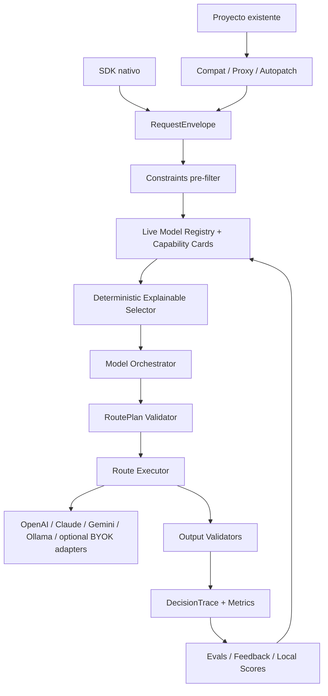

# Crupier: Roadmap Maestro

Fecha: 2026-06-19  
Estado: plan de trabajo vivo.

## Objetivo del Documento

Este documento ordena lo que ya existe, lo que falta y el orden correcto de construccion. La prioridad es evitar avanzar "a saltos" y mantener claro el producto:

> Crupier es un SDK Python que mantiene un catalogo vivo de modelos, aplica constraints duros, elige o combina modelos segun la peticion, ejecuta rutas reales, evalua resultados y deja trazas explicables.

Tambien debe convertirse en una capa drop-in para proyectos existentes: instalar, configurar y empezar a enrutar llamadas de IA sin reescribir la app cuando el stack permita proxy, autopatch o cliente compatible.

## Estado Actual

Ya existe una base funcional:

- Paquete Python `crupier` con `pyproject.toml`.
- CLI: `init`, `update`, `models list`, `models discover`, `models allow`, `route`, `deal`, `smoke`.
- CLI: `verify` para comprobar config/env/discovery/readiness/smoke con OpenAI como baseline por defecto.
- Configuracion `crupier.toml`.
- Registry local y capability cards.
- `update --online` para descubrir modelos reales disponibles en cuentas OpenAI, Anthropic, Google Gemini y Ollama Cloud.
- Adapters reales de texto:
  - OpenAI Responses API.
  - Anthropic Claude Messages API.
  - Google Gen AI SDK / Gemini API.
  - Ollama Cloud native `/api/chat` con host local explicito opcional.
- Smoke real validado con OpenAI, Anthropic y Ollama Cloud; Google queda listo para validar cuando haya clave.
- Verificacion unificada de proveedores para OpenAI, Anthropic Claude, Google Gemini y Ollama.
- Selector determinista explicable con `selection_scores`.
- `PlanningContext`, `Orchestrator` interface, `DeterministicOrchestrator` y `ModelOrchestrator` inicial como piezas intercambiables del planner.
- Guardrail del orquestador para no degradar rutas `agentic` de alto riesgo/tools a estrategias debiles como `cascade`.
- Planner multimodal inicial:
  - `FileAsset`
  - `FileRoutingPlan`
  - `deal(..., files=[...])`
  - `crupier route/deal --file ...`
  - filtrado de modelos por vision/file input requerido.
- Ejecucion multimodal inicial:
  - imagenes locales nativas con OpenAI Responses
  - imagenes locales nativas con Anthropic Messages
  - imagenes locales nativas con Google Gemini
  - imagenes locales nativas con Ollama `/api/chat`
  - archivos texto/codigo locales como contexto extraido
  - PDFs locales como texto extraido via `pypdf` o `pdftotext`
  - canaries reales de archivo de texto e imagen en `crupier audit --real`
- Clasificacion inicial de tipo de modelo:
  - `model_kind="chat"` vs `model_kind="embedding"`
  - `supports_embeddings`
  - `embedding_dimensions`
  - probe real `embeddings`
  - Ollama/Ollama Cloud no se considera vectorial salvo modelo dedicado o probe verificado.
- Compatibilidad drop-in inicial:
  - `crupier.compat.openai.OpenAI`
  - `responses.create`
  - `chat.completions.create`
  - `embeddings.create`
  - objetos respuesta con atributo/dict y `model_dump()`
  - stream compatible con eventos Responses y chunks Chat Completions
  - errores HTTP OpenAI-like con `x-request-id`
  - `crupier.install("openai")`
- `crupier serve`
- `GET /health`
- `GET /v1/models`
- `POST /v1/responses`
- `POST /v1/chat/completions`
- `POST /v1/embeddings`
- Comparacion A/B inicial:
  - `crupier eval compare`
  - `crupier eval compare-dataset`
  - variantes por modelo forzado o JSON
  - checks deterministas
  - recomendacion por pass/coste/latencia/model count
  - preguntas humanas por variante
  - agregado por modelo/modo y aplicacion `eval:<mode>` a capability cards
  - historico metadata-only de comparaciones
  - confianza/tendencia antes de aplicar scores
- Auditoria de adopcion:
  - `crupier audit`
  - route reviews con preguntas humanas
  - canaries reales opcionales con `--real`
  - reportes JSON/Markdown en `.crupier/audits/`
- Plan de adopcion:
  - `crupier adopt doctor`
  - `crupier adopt package`
  - `crupier adopt handoff`
  - `crupier adopt plan`
  - `crupier adopt patches`
  - readiness gates para auditoria, canaries reales, eval history, feedback humano, signoff humano y comentarios de codigo
  - modo `crupier adopt doctor --production` que exige canaries reales, eval history, feedback humano y signoff humano aprobatorio
  - recomendacion proxy / compat_client / autopatch / native_sdk
  - blockers, framework hints, checklist y comentarios justificativos
  - diffs/snippets sugeridos sin modificar archivos
- Feedback humano de proyecto:
  - `crupier feedback record`
  - `crupier feedback summary`
  - `crupier feedback apply`
  - `feedback record --compare-report` para registrar juicio humano desde un eval comparativo revisado
  - `feedback review --compare-report` para crear paquetes de revision humana con comandos de feedback
  - `feedback review --write-decisions-template` y `feedback import-decisions` para convertir plantillas editadas por humanos en senales aplicadas al selector
  - doctor exige que feedback humano registrado este aplicado a capability cards para produccion
  - feedback de reportes dry-run queda marcado como `dry_run_source` y no cierra produccion
  - senal `human_feedback` visible en `selection_scores`
  - sin almacenar prompts/respuestas en el feedback
- Signoff humano de adopcion:
  - `crupier adopt signoff --verdict approve|reject|needs_work`
  - registro metadata-only en `.crupier/handoffs/signoffs.jsonl`
  - doctor bloquea produccion si no hay signoff aprobatorio
  - `reject` y `needs_work` bloquean aunque el codigo y los canaries pasen
- Comentarios de codigo para programadores:
  - `crupier code comments`
  - `code comments --write-review-comments` para generar paquetes Markdown/JSONL de comentarios de review sin snippets de fuente
  - `code comments --write-sarif` para generar anotaciones SARIF consumibles por GitHub Code Scanning/CI
  - `code comments --write-decisions-template` y `--import-decisions` para revision granular por fingerprint
  - `code comments --ack-reviewed` para cerrar comentarios ya revisados por un programador
  - deteccion de call sites OpenAI/Anthropic/Ollama/Google
  - deteccion de modelos hard-codeados y posibles credenciales inline
  - exclusion de artefactos generados/dependencias (`build`, `dist`, `.venv`, `node_modules`, `*.egg-info`)
  - patrones de credenciales mas estrictos para evitar falsos positivos como identificadores cortos con guion o regexes de redaccion
  - credenciales sinteticas en `tests/`, `fixtures/` y archivos `test_*` quedan como P3 de fixture, no como bloqueantes P1 de produccion
- Adopcion drop-in sin config:
  - `crupier adopt package` funciona sin `crupier.toml` en modo offline y genera el paquete humano completo con indice persistente en `.crupier/packages/`, SARIF de comentarios y plantilla granular de decisiones
  - `crupier adopt doctor` funciona sin `crupier.toml` en modo offline
  - `crupier adopt plan` funciona sin `crupier.toml`
  - `crupier adopt patches` funciona sin `crupier.toml`
  - `crupier adopt handoff --write-report` funciona sin `crupier.toml` en modo offline
  - nombre de proyecto inferido desde `package.json`, `pyproject.toml` o directorio
  - `review_contract` separa evidencia tecnica de aprobacion humana y mantiene `must_not_auto_approve=true` mientras queden gates humanos abiertos
- Persistencia opt-in de trazas:
  - `crupier trace list/show/delete/replay`
  - metadata sin prompts/respuestas por defecto
  - replay solo con `store_prompt=true`
- Constraints iniciales:
  - allow/deny models.
  - proveedores habilitados/deshabilitados.
  - bloqueo de `latest`, preview y experimental salvo opt-in.
  - soporte tools/structured output a nivel constraints.
  - OpenRouter no default, BYOK opcional conceptual.
- Release readiness inicial:
  - `crupier release check`
  - build local de sdist + wheel
  - inspeccion de contenido de artefactos para bloquear `.env`, `.crupier`, caches y confirmar `py.typed`
  - `twine check`
  - smoke de instalacion/import/CLI/`crupier init`/`crupier route`/Python SDK quickstart desde wheel y sdist limpios
  - validacion de defaults publicos seguros (`crupier init` con Ollama Cloud, prompts/responses opt-in)
  - `py.typed`
  - bloqueo de versiones no finales en el release gate; public release `0.1.0`
  - guardrail de lenguaje publico para que metadata/docs de publicacion no regresen a etiquetas de release no final
  - plantillas publicas de colaboracion: Code of Conduct, bug report, feature request y pull request
  - release check de `community_files` para mantener esa superficie publica
  - Dependabot para Python tooling y GitHub Actions
  - release check de `dependency_updates` y permisos minimos de CI
  - Ruff en modo lint critico (`E9,F63,F7,F82`) para errores graves de Python
  - `pip-audit` en workflow dev/CI/publish para auditoria basica de vulnerabilidades de dependencias
  - workflows con acciones actuales (`checkout@v6`, `setup-python@v6`, `upload-artifact@v6`)
  - workflow de publicacion conserva `dist/*` como artefacto antes de publicar
  - modo estricto `crupier release check --strict-public` para bloquear warnings y builds omitidas antes de PyPI
  - preflight externo opcional `crupier release check --check-pypi-name` para comprobar disponibilidad/control del nombre en PyPI
  - modo final `crupier release check --verify-providers` para bloquear publicacion si discovery/readiness/smoke reales fallan
  - workflow de publicacion PyPI por trusted publishing
- `SECURITY.md`
  - politica publica con scope, reporte privado, versiones soportadas, divulgacion y manejo de secretos
  - release check de `security_policy` valida contenido util, no solo existencia
- `CHANGELOG.md`
- `CONTRIBUTING.md`
- workflow CI para tests/build/release check
- ejemplo ejecutable `examples/sdk_dry_run.py` sin SDKs de proveedor ni API keys
- Tests unitarios actuales: 203.
- Verificacion local reciente:
  - `pytest`: 203 passed.
  - `python -m ruff check src tests --select E9,F63,F7,F82`: all checks passed.
  - `python -m pip_audit --skip-editable --progress-spinner off`: no known vulnerabilities found.
  - `crupier release check`: 22 checks passed, 1 warning for missing public `[project.urls]`.
  - `crupier release check --check-pypi-name`: PyPI project name currently available for a first public upload.
  - `crupier release check --strict-public --check-pypi-name --verify-providers --provider openai --provider anthropic --provider ollama`: 24 checks passed, PyPI name disponible y proveedores reales listos; falla correctamente solo por `[project.urls]` hasta que existan URLs publicas reales.
  - build local `dist/crupier-0.1.0.tar.gz` y `dist/crupier-0.1.0-py3-none-any.whl`: `twine check` passed.
  - `crupier verify --provider openai --provider anthropic --provider ollama`: 3 providers ready.
  - `crupier audit --real --provider openai --provider anthropic --provider ollama --no-code-comments`: 13 checks passed, con canaries reales OpenAI + Anthropic + Ollama Cloud.

## Huecos Principales

Lo que existe todavia no es el producto completo. Faltan piezas criticas:

1. Orquestador real basado en modelo.
2. Algoritmo de eleccion mas robusto y calibrable.
3. Capability cards verificadas y flujo recurrente de `crupier verify`.
4. Costes reales y budgets efectivos.
5. Structured output real por proveedor.
6. Tools reales por proveedor.
7. Streaming real.
8. Fallback semantico robusto.
9. Evals locales, benchmarks propios y feedback humano. Inicial hecho; falta ampliar datasets, A/B y calibracion estadistica.
10. Persistencia opt-in de trazas. Inicial hecho; falta TTL/purge automatico y snapshots completos por trace.
11. Snapshot/lock para produccion.
12. Privacidad operativa: secret redaction, deletion, audit, sin gateway de contenido.
13. Release PyPI publico: cuenta/proyecto PyPI externo, versioning policy y docs website.
14. Documentacion de uso end-to-end mas amplia por framework/proveedor.
15. Capa drop-in para proyectos existentes.
16. PDF nativo, tablas/OCR, audio/video y documentos Office.
17. Matriz amplia de auditorias humanas por framework/proyecto real.

## Que Queda Desde Aqui

Para que una persona pueda usar Crupier encima de un proyecto real, el nucleo minimo ya esta en pie: doctor de adopcion, comentarios para programadores, rutas explicables, providers reales, canaries, evals, feedback humano y release check. Lo que falta se agrupa en cuatro bloques:

1. Calibracion del orquestador: mas datasets por dominio, comparacion deterministic vs hybrid/model, metricas de coste/latencia/calidad y defaults por perfil.
2. Matriz drop-in: probar compatibilidad con mas SDKs y frameworks reales, async, streaming nativo de proveedor, errores y responses mas compatibles.
3. Multimodal avanzado: PDF nativo, tablas, OCR, documentos Office, audio/video y probes nativos por proveedor/modelo.
4. Release publico: versioning policy, lint/type check, docs website y validacion TestPyPI/PyPI.

La regla de avance debe ser: cada bloque nuevo necesita tests unitarios, al menos un comando humano de verificacion, y cuando aplique, un probe real con las claves disponibles.

Estado de puerta productiva del proyecto actual:

- `adopt doctor --production --real --provider anthropic --provider ollama` pasa canaries reales.
- Ya hay historial A/B real registrado con confianza media en modo `fast`.
- Las senales automaticas `eval:fast` ya se aplicaron a las capability cards de OpenAI y Anthropic con gate `min-count=3`, `min-confidence=medium`.
- Todavia bloquea produccion por no tener feedback humano aplicado y por no tener signoff humano aprobatorio.
- Ya existe el flujo `eval compare --no-dry-run --write-report` -> `feedback review --write-report --write-decisions-template` -> `feedback import-decisions --apply-to-registry` para cerrar esa evidencia humana sin copiar prompts/respuestas.
- Compare real reciente listo para revision humana en `.crupier/evals/runs/compare_20260619T011417Z.json`.
- Plantilla humana real, no dry-run, lista en `.crupier/feedback/decisions/human_decisions_20260619T011424Z.json`.
- Ya existe el ledger `code comments --ack-reviewed` para cerrar comentarios de codigo revisados; el proyecto actual tiene 100 comentarios pendientes, repartidos en P2/P3 sin P1 falsos, hasta que un programador inspeccione el reporte limpio y ejecute ack o importe la plantilla granular.
- Reporte actual de comentarios generado en `.crupier/audits/code_comments_20260619T092145Z.md`.
- Paquete actual de review comments generado en `.crupier/code-comments/review_comments_20260619T092145Z.md`.
- SARIF actual de comentarios generado en `.crupier/code-comments/code_comments_20260619T092145Z.sarif`.
- Plantilla granular actual generada en `.crupier/code-comments/decisions/code_comment_decisions_20260619T092145Z.json`.
- Indice actual de paquete humano generado en `.crupier/packages/adoption_package_20260619T092145Z.md`.
- Ya existe `adopt handoff` para entregar a un humano los artefactos recientes, acciones obligatorias y comandos siguientes.
- Handoff real de produccion generado en `.crupier/handoffs/adoption_handoff_20260619T092145Z.md`; queda bloqueado por feedback humano no aplicado y signoff humano ausente, aunque los canaries reales pasen. El `review_contract` marca `technical_status=ready_with_warnings`, `human_status=blocked` y `must_not_auto_approve=true`.
- Prueba externa sobre `Alfred07/alfred-dev`:
  - `adopt package` sin `crupier.toml` genera doctor, patches, code comments, review comments, SARIF, plantilla granular de decisiones, handoff, `review_contract` e indice en `Alfred07/alfred-dev/.crupier/packages/adoption_package_20260619T092201Z.md`
  - `adopt doctor --write-report` sin `crupier.toml` funciona y genera doctor offline en `Alfred07/alfred-dev/.crupier/audits/project_doctor_20260619T084540Z.md`
  - `adopt plan` sin `crupier.toml` funciona y recomienda `native_sdk`
  - `adopt handoff --write-report` sin `crupier.toml` genera paquete de revision offline
  - `code comments` bajo de 25 falsos positivos iniciales a 4 comentarios reales en tests de secretos
  - reportes generados en `Alfred07/alfred-dev/.crupier/audits/`
  - paquete de review comments generado en `Alfred07/alfred-dev/.crupier/code-comments/review_comments_20260619T092201Z.md`
  - SARIF generado en `Alfred07/alfred-dev/.crupier/code-comments/code_comments_20260619T092201Z.sarif`
  - plantilla granular generada en `Alfred07/alfred-dev/.crupier/code-comments/decisions/code_comment_decisions_20260619T092201Z.json`
  - handoff offline generado en `Alfred07/alfred-dev/.crupier/handoffs/adoption_handoff_20260619T092201Z.md`

## Vision de Arquitectura Final



Regla central:

> El orquestador nunca decide sobre modelos prohibidos. Primero filtra constraints del proyecto, despues puntua el selector, despues decide el orquestador, despues valida otra vez.

## Orquestador: Que Falta

Ahora existe un selector determinista. Eso es bueno como base, pero no basta.

### Lo que debe hacer el orquestador

El orquestador debe recibir un contexto estructurado:

- Peticion resumida.
- Modo: `agentic`, `cheap`, `fast`, `private`, `research`, `structured`, etc.
- Modelos permitidos por constraints del proyecto.
- Capability cards.
- `selection_scores` del selector determinista.
- Coste estimado.
- Latencia estimada.
- Benchmarks/evals locales.
- Restricciones: coste, privacidad, region, tools, schema, streaming, riesgo.
- Historial agregado del proyecto si existe.

Y debe devolver un `RoutePlan` estructurado:

- `strategy`: `single`, `fallback`, `cascade`, `fusion`, `critique_repair`, etc.
- pasos concretos
- modelos concretos
- razon de la decision
- riesgos
- coste/latencia esperada
- condiciones de escalado/fallback

### Lo que NO debe hacer

- No debe ver prompts sensibles si la configuracion de privacidad lo prohibe.
- No debe elegir modelos fuera de allowlist.
- No debe saltarse privacy/ZDR/region.
- No debe activar fusion por defecto porque "suena mejor".
- No debe inventar capacidades.
- No debe exponer chain-of-thought.

### Plan para el orquestador

Fase 1: mantener selector determinista como baseline.

Fase 2: crear `Orchestrator` interface. Hecho.

```python
class Orchestrator:
    def plan(context: PlanningContext) -> RoutePlan:
        ...
```

Fase 3: implementar `DeterministicOrchestrator`, usando el selector actual. Hecho.

Fase 4: implementar `ModelOrchestrator`, que llama a un modelo configurado para proponer `RoutePlan` en JSON. Inicial hecho.

Fase 5: validar todo `RoutePlan` del modelo con `PolicyEngine`. Inicial hecho.

Fase 6: comparar deterministic vs model-powered en evals.

Fase 7: permitir modos:

- `orchestrator = "deterministic"`
- `orchestrator = "model"`
- `orchestrator = "hybrid"`
- `orchestrator = "locked"`

## Algoritmo de Eleccion de Modelos

El algoritmo final debe tener varias capas.

### Capa 1: Filtros duros

Estos eliminan modelos antes de puntuar:

- proveedor deshabilitado
- modelo no permitido
- modelo denegado
- `latest` no permitido
- preview/experimental no permitido
- ZDR requerido y modelo no apto
- region prohibida
- coste maximo imposible
- modality no soportada
- tools requeridas y modelo no las soporta
- structured output requerido y modelo no lo soporta

### Capa 2: Scoring explicable

Ya existe una version inicial. Debe evolucionar para incluir:

- calidad
- coste
- latencia
- fiabilidad historica
- tasa de errores
- tasa de refusals
- schema validity
- tool success
- resultados de evals locales
- benchmarks externos
- afinidad con task type
- preferencia de diversidad de familia/proveedor
- estabilidad del modelo
- disponibilidad/rate limits

Cada puntuacion debe explicar:

```json
{
  "model": "openai:gpt-5.4-mini",
  "score": 18.5,
  "terms": [
    {"name": "latency", "value": 8, "reason": "fast mode"},
    {"name": "local_eval", "value": 5.5, "reason": "agentic eval"},
    {"name": "cost", "value": 4, "reason": "low cost tier"}
  ]
}
```

### Capa 3: Estrategia

El selector elige modelos, pero el orquestador elige estrategia:

- `single`: cuando la tarea es simple o el mejor modelo domina.
- `cascade`: cuando podemos probar barato y validar.
- `fallback`: cuando queremos resiliencia.
- `fusion`: cuando hay alta incertidumbre o decision cara.
- `critique_repair`: cuando se necesita verificacion.
- `local_first`: cuando privacidad/coste/local importan.
- `panel`: cuando el humano quiere comparar.

### Capa 4: Validacion del plan

Todo plan se valida de nuevo:

- modelos permitidos
- presupuesto
- llamadas maximas
- recursion depth
- strategy permitida
- tools permitidas
- logging permitido
- region/privacy

### Capa 5: Feedback

Cada ejecucion alimenta:

- latencia real
- coste real
- errores
- refusals
- output validation
- user rating opcional
- eval score

Esto actualiza `local_eval_scores` o metricas de runtime.

## Roadmap por Fases

### Fase 0: Base del SDK

Estado: hecho.

Incluye:

- paquete
- config
- CLI
- providers reales de texto
- model discovery
- online update
- smoke real
- selector explicable inicial

Criterio de exito:

- tests pasan
- smoke real pasa en OpenAI, Claude y Ollama
- `route` muestra puntuaciones explicables

### Fase 1: Registry Vivo y Snapshots

Objetivo: que Crupier sepa que modelos existen ahora, pero pueda congelar produccion.

Estado: en progreso.

Hecho:

- `registry snapshot create`
- `registry snapshot list`
- `registry snapshot diff`
- `registry snapshot use`
- snapshots `--allowed-only`
- restore opcional de allowlist
- `update --online --dry-run` con diff legible
- deteccion de modelos nuevos/eliminados
- deteccion de cambios top-level en capability cards
- estados de registry: `discovered`, `allowed`, `locked`, `stale`, `builtin`, `local`
- tests de create/diff/use y CLI

Falta:

- persistir estado `locked` como constraints activos de ejecucion, no solo como procedencia de snapshot
- borrar o archivar stale cards con confirmacion explicita
- diff profundo por nested fields cuando haga falta

Criterio de exito:

- puedo descubrir modelos vivos
- puedo permitir solo algunos
- puedo bloquear snapshot
- una ruta pasada se puede reproducir con su snapshot

### Fase 2: Capability Cards Verificadas

Objetivo: no confiar solo en heuristicas.

Estado: en progreso.

Hecho:

- runner SDK `crupier.capabilities.probe(...)`
- comando `crupier capabilities probe`
- probe real `text_basic`
- probe real `json_instruction`
- probe generico `max_output_param`
- structured output nativo por provider adapter
- tool call nativo por provider adapter
- streaming nativo por provider adapter
- persistencia opcional con `--apply`
- `capability_status` y `probe_results` en capability cards
- estados `verified`, `inferred`, `unknown`, `failed` en resultados reales
- constraints bloquean capacidades con probe `failed`
- selector puntua `verified` por encima de `inferred`
- constraint `require_verified_capabilities`
- comando `crupier capabilities readiness`
- SDK `crupier.capabilities.readiness(...)`
- modo `--dry-run` sin llamadas a proveedor
- no se guardan prompts/respuestas crudas en resultados

Falta:

- max output real hasta limite progresivo del modelo
- validacion por matriz proveedor/modelo para structured output
- validacion por matriz proveedor/modelo para tool call
- streaming con captura de métricas de first-token/throughput
- ejecucion real de PDF nativo, tablas/OCR, audio/video y documentos Office
- probes nativos de vision/PDF/audio cuando el proveedor lo soporte
- implementacion de OCR/extraccion/chunking para PDFs, imagenes, audio, video y documentos
- decidir si `require_verified_capabilities` debe ser default para produccion

Comando:

```bash
crupier capabilities probe --provider openai
crupier capabilities probe --model openai:gpt-5.4-mini
crupier capabilities probe --provider openai --apply
```

Criterio de exito:

- Crupier no dice "supports_tools=true" salvo que lo haya verificado o cite fuente.

### Fase 3: Orquestador Hibrido

Objetivo: pasar de selector determinista a orquestador robusto.

Estado: en progreso.

Hecho:

- `PlanningContext`
- `Orchestrator` interface
- `DeterministicOrchestrator`
- `ModelOrchestrator` opt-in
- `RoutePlanner` como fachada compatible que delega en orquestadores
- propuesta de `RoutePlan` en JSON
- parsing/repair inicial de JSON invalido
- validacion contra `PolicyEngine.validate_route`
- validacion estricta de forma con `validate_route_plan_shape`
- fallback determinista si el modelo falla, inventa modelos o viola policy
- guardrail: el modelo orquestador no puede saltarse estrategias explicitas de perfiles
- tests de contexto y equivalencia determinista
- tests de plan model-powered valido e ilegal
- `crupier eval run` con dataset built-in y datasets JSON/JSONL
- eval real `hybrid` validado contra OpenAI como orquestador
- `crupier.toml` real en el proyecto con OpenAI, Anthropic y Ollama Cloud
- readiness real de OpenAI, Anthropic y Ollama Cloud en estado `ready`

Falta:

- comparacion deterministic vs model-powered en evals
- metricas de acierto/coste/latencia del orquestador
- decidir defaults de produccion por perfil/proyecto

Criterio de exito:

- el modelo orquestador puede proponer rutas
- el validador rechaza rutas ilegales
- deterministic y model-powered se comparan en evals

### Fase 4: Coste, Latencia y Budgets Reales

Objetivo: que Crupier no gaste a ciegas.

Estado: en progreso.

Hecho:

- estimacion de coste por ruta antes de ejecutar
- budget duro `max_cost_usd` antes de proveedor
- error tipado `CrupierBudgetExceededError`
- coste actual estimado desde usage cuando el proveedor lo devuelve
- flags CLI `--max-cost-usd` y `--max-output-tokens`
- flag CLI `--force-model` para pruebas humanas controladas
- el modelo orquestador no puede declarar su propio coste confiable; Crupier recalcula

Falta:

- precios reales online por modelo
- budget por run/agente
- budget por proyecto/tenant
- circuit breakers

Criterio de exito:

- una ruta no puede superar presupuesto sin error/confirmacion
- fusion muestra coste esperado antes de ejecutar

### Fase 5: Structured Output Real

Objetivo: soportar JSON/schema de verdad.

Estado: en progreso.

Hecho:

- `response_schema` ejecuta llamadas reales en modo no dry-run
- parsing JSON local
- validacion local de subset JSON Schema
- un repair attempt con el mismo modelo
- `output_json` validado
- error tipado `CrupierStructuredOutputError`
- flag CLI `--response-schema`

Falta:

- mapping OpenAI structured output
- mapping Anthropic tool/schema compatible
- mapping Ollama si soporta formato/JSON
- semantic validators
- validacion JSON Schema completa

Criterio de exito:

- `response_schema=MyModel` devuelve `output_json` validado
- si JSON parsea pero es semanticamente incorrecto, falla o repara

### Fase 6: Tools Reales

Objetivo: agentes de verdad.

Estado: en progreso.

Hecho:

- normalizacion de tools locales desde callables o specs dict
- loop provider-agnostic: plan JSON de tool calls, ejecucion local, respuesta final con resultados
- `requires_approval` y `approved_tools` para tools sensibles
- `allowed_tools` por request
- ledger de tool calls en `provider_metadata`
- idempotency key para evitar duplicados con mismos argumentos
- tests de ejecucion segura, aprobacion e idempotencia
- prueba real con OpenAI: modelo solicita `lookup_user`, Crupier ejecuta handler local y devuelve respuesta final con ledger

Falta:

- mapping por proveedor
- retries seguros
- politicas mas finas para side effects externos no idempotentes
- soporte de multiples rondas de tools cuando el modelo necesite encadenarlas

Criterio de exito:

- un agente puede usar tools simples. Inicial hecho.
- acciones sensibles requieren aprobacion. Inicial hecho.
- retries no duplican efectos externos mas alla del idempotency key local.

### Fase 7: Streaming Real

Objetivo: UX buena y baja latencia.

Falta:

- OpenAI streaming
- Anthropic streaming
- Ollama streaming
- eventos normalizados
- fusion streaming:
  - status inmediato
  - panel debug opcional
  - final answer stream
- error recovery

Criterio de exito:

- `crupier.stream(...)` emite eventos reales por proveedor
- la app puede renderizar texto incremental

### Fase 8: Fallback y Fusion de Produccion

Objetivo: robustez real, no demo.

Falta:

- clasificar errores:
  - auth
  - rate limit
  - timeout
  - provider refusal
  - provider down
  - schema fail
- fallback solo cuando corresponda
- refusals del proveedor no se reintentan salvo que sean claramente un problema de capacidad/disponibilidad
- fusion con:
  - panel timeout
  - partial results
  - judge structured
  - contradiction summary
  - confidence
  - cost cap

Criterio de exito:

- fallback no viola constraints
- fusion mejora resultados en evals concretas o no se usa

### Fase 9: Evals y Benchmarks

Objetivo: que el algoritmo aprenda con datos del proyecto.

Hecho inicial:

- formato datasets
- `crupier eval run`
- feedback humano `record/summary/apply`
- paquetes de revision humana `feedback review`
- escritura de senales `human:<mode>` en capability cards
- selector cambia ranking por `human_feedback`
- comparacion A/B inicial con `crupier eval compare`
- comparacion A/B por dataset con `crupier eval compare-dataset`
- escritura de senales automaticas `eval:<mode>` en capability cards
- historico de comparaciones `crupier eval history`
- gating por `min_count` y `min_confidence` antes de aplicar scores

Falta:

- metrics:
  - exactitud
  - schema validity
  - tool success
  - latency
  - cost
  - refusals
  - human rating
- jueces LLM opcionales
- validators deterministicos
- intervalos de confianza estadisticos formales y tests A/B con significancia
- generar `local_eval_scores` desde evals automaticos, no solo feedback manual

Criterio de exito:

- selector puede cambiar ranking por eval local
- se puede demostrar si fusion ayuda o no

### Fase 10: Privacidad, Secret Hygiene y Observabilidad

Objetivo: que pueda usarse en proyectos serios.

Hecho inicial:

- trace persistence opt-in
- purge por request/trace
- redaction de secretos en trazas guardadas
- metadata sin prompts/respuestas por defecto
- feedback/eval history sin prompts/respuestas crudas

Falta:

- TTL obligatorio para full logs
- redaccion opcional para trazas/evals, sin convertirlo en gateway de contenido
- OpenTelemetry
- metric hooks
- audit export
- no secrets in errors/logs

Criterio de exito:

- no se guardan prompts/respuestas por defecto
- se puede borrar un trace
- logs no filtran keys/secrets

### Fase 11: Integraciones de Agentes

Objetivo: que Crupier sea natural para agentes.

Falta:

- `AgentStateSummary`
- run/step/depth tracking
- max depth/calls/cost
- recursion protection
- LangGraph adapter
- OpenAI Agents SDK helper
- CrewAI/LangChain opcional
- compact routing summaries

Criterio de exito:

- un agente multi-step usa Crupier por paso sin loops infinitos
- la decision de modelo considera objetivo global y presupuesto restante

### Fase 12: Packaging y Release

Objetivo: publicar seriamente.

Estado: en progreso.

Hecho:

- `pyproject.toml` con metadatos, extras y console script
- `crupier release check`
- validacion de metadata/version/README/security/changelog/CI/extras/script
- warning no bloqueante para URLs publicas reales en `[project.urls]`
- validacion de defaults publicos seguros (`crupier init` con Ollama Cloud, prompts/responses opt-in)
- bloqueo de versiones no finales; public release `0.1.0`
- modo estricto `crupier release check --strict-public` para publicar solo sin warnings y con build completo
- modo final `crupier release check --verify-providers` con discovery/readiness/smoke reales
- build local de sdist + wheel desde release check
- inspeccion de contenido de artefactos
- `twine check`
- `py.typed`
- smoke de instalacion desde wheel y sdist en venvs temporales, import de `crupier`, `crupier --help`, `crupier init`, dry-run `crupier route` y `Crupier.from_project().deal(..., dry_run=True)`
- workflow GitHub Actions para pytest, distribuciones y release check
- workflow GitHub Actions de publicacion PyPI por trusted publishing
- `SECURITY.md`
- `CHANGELOG.md`
- `CONTRIBUTING.md`
- `LICENSE` MIT y metadata de licencia
- ejemplo offline ejecutable para onboarding SDK
- politica de versionado publica en `docs/crupier-publishing.md`
- Nombre `crupier` disponible en PyPI al comprobarlo el 2026-06-19; tambien estaban libres `crupier-ai`, `crupier-sdk` y `model-crupier`

Falta:

- lint/type check
- docs website
- mas examples end-to-end
- release dry-run/TestPyPI antes de public PyPI

Criterio de exito:

- `pip install crupier`
- tests en CI
- release reproducible

### Fase 13: Compatibilidad Drop-In

Objetivo: que Crupier pueda entrar en proyectos existentes con cero cambios de codigo cuando sea posible, o con cambios minimos cuando el stack lo requiera.

Falta:

- server OpenAI-compatible:
  - `/v1/responses` inicial hecho
  - `/v1/chat/completions` inicial hecho
  - `/v1/embeddings` inicial hecho
  - streaming SSE compatible inicial hecho; streaming nativo de proveedor pendiente
  - errores compatibles iniciales hechos con status/type/code/request id
- cliente compatible Python:
  - `crupier.compat.openai.OpenAI` inicial hecho
  - response objects compatibles iniciales hechos
  - async pendiente
- autopatch opt-in:
  - `crupier.install("openai")` inicial hecho
  - `CRUPIER_AUTOPATCH=openai,anthropic` pendiente
  - reversible y versionado
- modos de compatibilidad:
  - `strict`
  - `balanced`
  - `aggressive`
  - `locked`
- pass-through para endpoints desconocidos o no mejorables
- matriz de tests contra SDKs reales soportados
- guias de integracion:
  - proyectos OpenAI Python
  - Anthropic Python
  - LangChain
  - LlamaIndex
  - LiteLLM
  - apps no Python via `base_url`

Criterio de exito:

- una app OpenAI Python existente puede cambiar solo `OPENAI_BASE_URL` o una linea de import y conservar forma basica de respuesta, streaming y errores.
- Crupier enruta, mide coste/latencia y deja trazas opt-in sin romper el contrato esperado por la app.

## Prioridad Recomendada

Orden recomendado desde hoy:

1. Fase 2: capability probes.
2. Fase 3: orquestador hibrido.
3. Fase 4: coste/budgets.
4. Fase 5: structured output.
5. Fase 6: tools.
6. Fase 9: evals.
7. Fase 8: fusion/fallback avanzado.
8. Fase 7: streaming.
9. Fase 13: compatibilidad drop-in basica.
10. Fase 10-12: privacidad/observabilidad, agentes, release.

Motivo: sin registry confiable y probes, el orquestador decide con datos flojos. Sin budgets, fusion puede quemar dinero. Sin evals, no sabemos si el algoritmo mejora.

## Estado del Orquestador Hoy

Hoy Crupier tiene:

- selector determinista explicable
- estrategias basicas
- `PlanningContext` formal
- `Orchestrator` interface
- `DeterministicOrchestrator`
- `ModelOrchestrator` opt-in con repair/fallback
- `RoutePlanner` como fachada compatible
- constraint validation
- provider execution real

Hoy Crupier NO tiene todavia:

- modelo orquestador calibrado por mas evals de dominio
- comparacion estadistica deterministic vs model-powered
- aprendizaje automatico desde evals, aunque si tiene feedback humano manual aplicado al selector

Por tanto, el siguiente gran paso tecnico debe ser:

> Ampliar datasets de evals por dominio, medir coste/latencia/calidad del orquestador, comparar rutas A/B y usar esos resultados para actualizar `local_eval_scores` y defaults por perfil.

## Decision Clave Pendiente

Hay que decidir cuanto poder damos al modelo orquestador.

Recomendacion:

- En desarrollo: `hybrid`.
- En produccion: `deterministic` o `locked` hasta tener evals.
- En investigacion: `model` permitido con trace completo.

Config futura:

```toml
[orchestrator]
mode = "hybrid"
model = "openai:gpt-5.4-mini"
fallback = "deterministic"
require_validated_plan = true
allow_prompt_summary_only = true
```

## Definicion de Producto Listo

Crupier puede considerarse serio cuando:

- descubre modelos vivos
- verifica capacidades
- permite allowlist clara
- elige rutas explicables
- tiene orquestador validado
- mide coste/latencia
- soporta structured output y tools
- ejecuta evals
- no filtra secretos
- reproduce decisiones con snapshots
- tiene CI/release PyPI
- permite adopcion drop-in en proyectos OpenAI-compatible sin reescritura
